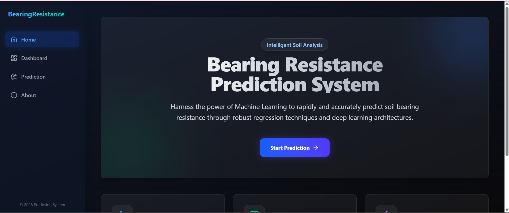
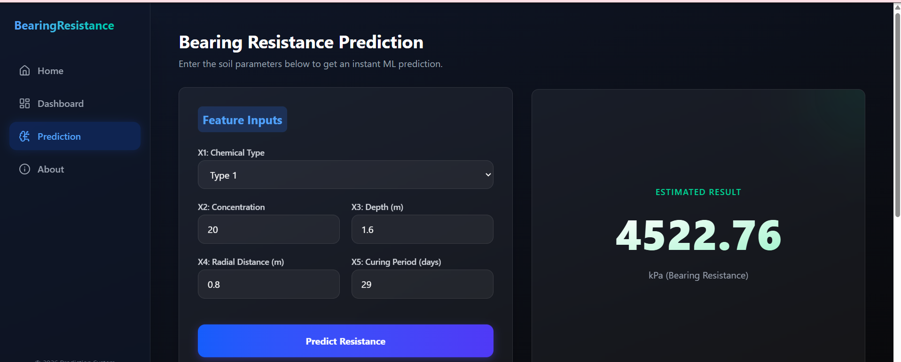
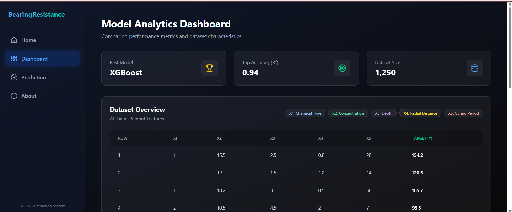

# 🔩 Bearing Resistance Prediction System

A Machine Learning-based web application that predicts **soil bearing resistance** using multiple regression algorithms and deep learning techniques. This project was developed as part of a **university minor project** to compare various regression models and provide an interactive prediction system.

🌐 **Live Demo:** https://bearing-resistance-ml.vercel.app/

---

## 📸 Project Screenshots

### 🏠 Home Page



### 📈 Prediction Interface



### 📊 Analytics Dashboard



---

## 📌 Project Overview

The objective of this project is to accurately predict **soil bearing resistance (kPa)** using machine learning models trained on engineering data. The application enables users to input soil parameters and instantly receive a predicted bearing resistance value.

---

## ✨ Features

- Interactive web interface
- Real-time bearing resistance prediction
- Multiple regression model comparison
- Model analytics dashboard
- Clean and responsive UI
- Dataset visualization

---

## 🤖 Machine Learning Models

The following models were implemented and evaluated:

- Linear Regression
- Ridge Regression
- Lasso Regression
- Elastic Net Regression
- Support Vector Regression (SVR)
- Decision Tree Regressor
- Artificial Neural Network (ANN)
- XGBoost Regressor

Among these, **XGBoost** achieved the best performance.

---

## 📊 Dataset

**Dataset Name:** AP data.xlsx

### Dataset Information

- Total Records: 159
- Input Features: 5
- Target Variable: Bearing Resistance

### Input Features

| Feature | Description |
|---------|-------------|
| X1 | Chemical Type |
| X2 | Concentration |
| X3 | Depth (m) |
| X4 | Radial Distance (m) |
| X5 | Curing Period (days) |

### Target

- Bearing Resistance (kPa)

---

## ⚙️ Project Workflow

1. Data Collection
2. Data Preprocessing
3. Feature Engineering
4. Train-Test Split
5. Feature Scaling
6. Model Training
7. Model Evaluation
8. Model Comparison
9. Web Application Deployment

---

## 🛠️ Tech Stack

### Programming Language

- Python

### Machine Learning

- Scikit-learn
- TensorFlow / Keras
- XGBoost

### Data Processing

- Pandas
- NumPy

### Visualization

- Matplotlib

### Development

- Google Colab
- Jupyter Notebook

### Deployment

- Vercel

---

## 📁 Repository Structure

```
Bearing-Resistance-Prediction/
│
├── AP data.xlsx
├── bearing_resistance_prediction.ipynb
├── requirements.txt
├── README.md
├── LICENSE
├── .gitignore
└── images/
    ├── homepage.png
    ├── prediction.png
    └── dashboard.png
```

---

## 🚀 Installation

Clone the repository

```bash
git clone https://github.com/isshhiittaaa/Bearing-Resistance-Prediction.git
```

Install dependencies

```bash
pip install -r requirements.txt
```

Run the notebook using Jupyter Notebook or Google Colab.

---

## 👥 Team Project

This project was developed as part of a **University Minor Project**.

My contributions included:

- Data preprocessing
- Machine learning model implementation
- Model training and evaluation
- Performance analysis
- Documentation

---

## 🔮 Future Improvements

- Hyperparameter Optimization
- Explainable AI (SHAP)
- Cross Validation
- Docker Deployment
- REST API Integration

---

## 📄 License

This project is licensed under the MIT License.

---

## 👩‍💻 Author

**Ishita Srivastava**

B.Tech Computer Science Engineering

Aspiring Data Analyst | Machine Learning Enthusiast

GitHub: https://github.com/isshhiittaaa
